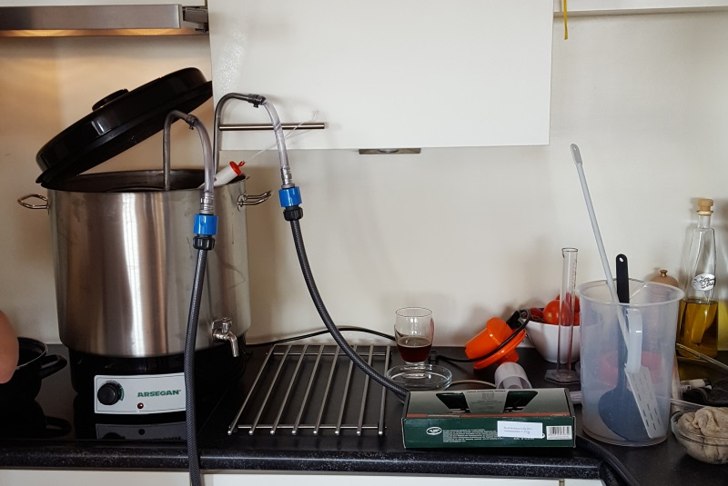
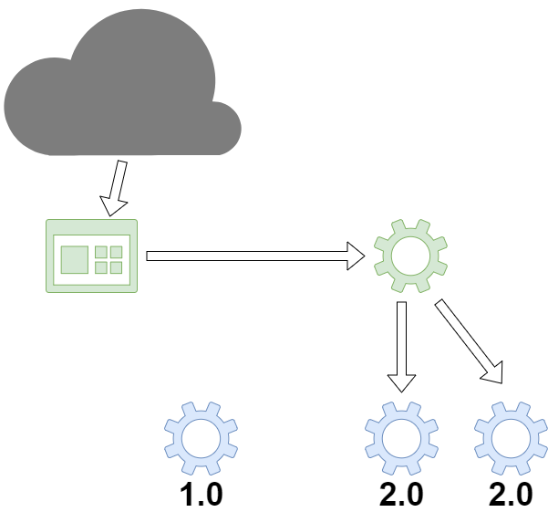
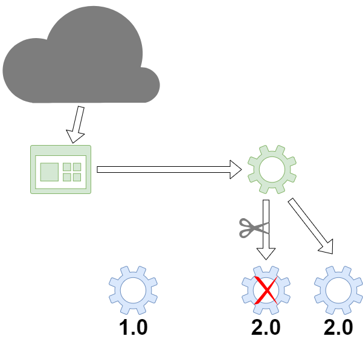
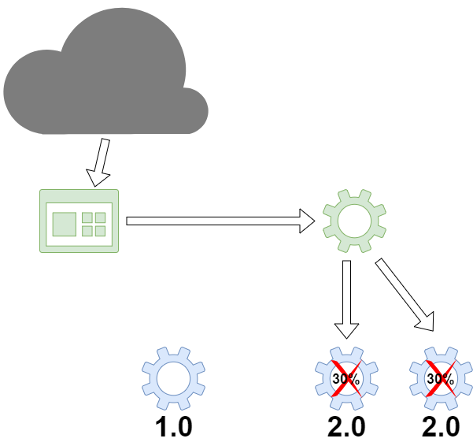
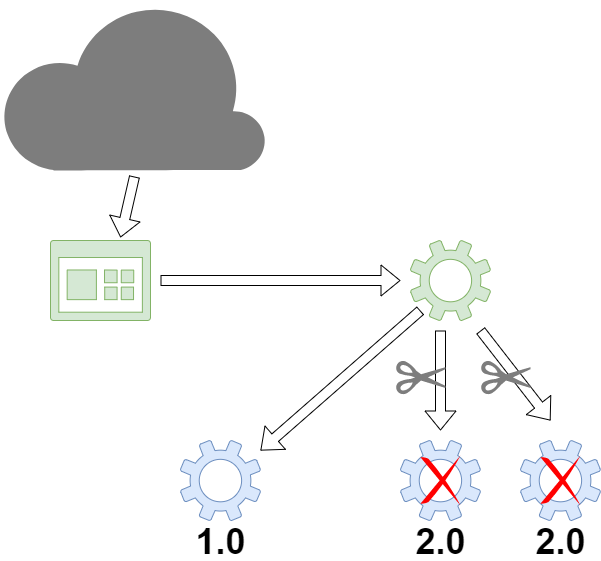

# Three resilience patterns out-of-the-box with Twitter's Finagle HTTP client
## Eggie van Buiten & Effi Bennekers

---

## Introduction

|  |  |
| - | - |
|  |  |
| Effi Bennekers | Eggie van Buiten |
| IT Chapter Lead<br/>Engineering @ ING | Developer @ ING |

^^^



^^^


Iets leuks over Eggie

---

## The challenge


Success rate of 0.99 ^ 100 = 0.37

^^^

### Resilience

Wikipedia: The ability to provide and maintain an acceptable level of service in the face of faults and challenges to normal operation.
 
Note:
- "I'm going to ask you a question. Show of hands please: who thinks a service level of 24/7 is feasible?"
- Het probleem schetsen dat 100% uptime niet te halen is

^^^

### Weather API use case



* One instance of the client API
* Two instances of the weather service API
* One instance of the old weather service API

Note:
Beschrijf de case
1 Website
We hebben 1 instance van een client api. Mobiele telefoon, weerstation, in dit geval api voor web client. 
We hebben 3 instances van een server api die weerrapporten levert
RPI 1) Weather service 2.0
RPI 2) Weather service 2.0
RPI 3) Old Weather service 1.0 (no wind) we do not use this anymore, but it is still running.

^^^

### Client code and setup

Code demo

^^^

### Finagle

From https://twitter.github.io/finagle/:

Finagle is an extensible RPC system for the JVM, used to construct high-concurrency servers. Finagle implements uniform client and server APIs for several protocols, and is designed for high performance and concurrency. Most of Finagle’s code is protocol agnostic, simplifying the implementation of new protocols.

---

## Load balancing

Weather API 2.0:

```java
@GetMapping("/weather")
public ResponseEntity<WeatherReport> getReport() {
    final WeatherReport report = new WeatherReport();
    report.setCondition(...);
    report.setTemperature(...);
    report.setWindForce(...);
    report.setWindDirection(...);
    return ResponseEntity.ok(report);
}
```

^^^

### Load balancing



---

## Retry



---

## Failover

Weather API 1.0:

```java
@GetMapping("/weather")
public ResponseEntity<WeatherReport> getReport() {
    final WeatherReport report = new WeatherReport();
    report.setCondition(...);
    report.setTemperature(...);
    #report.setWindForce(...); //DOES NOT WORK
    #report.setWindDirection(...); //DOES NOT WORK
    return ResponseEntity.ok(report);
}
```

^^^

### Failover



---

## Recap

* Resilience
* Load balancing
* Retry
* Failover
* Finagle

Note:
So if you take your uptime seriously and want a solution fast, use Finagle! 

---

## Questions?

Effi Bennekers
Efraim.Bennekers@ing.nl
https://www.linkedin.com/in/effibennekers/
@ebennekers

Eggie van Buiten
Eggie.van.Buiten@ingbank.com
