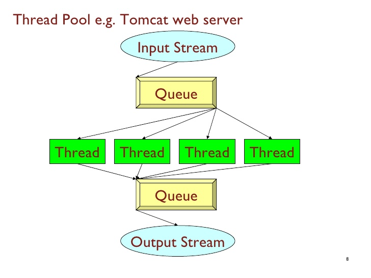

# Three resilience patterns out-of-the-box with Twitter's Finagle HTTP client
## Eggie van Buiten & Effi Bennekers

---

## Agenda
* Introductie
* The Challenge
* Load balancing
* Retry
* Failover
* Contact information and questions

*Dit laten we weg in de uiteindelijke presentatie*

---

## Introduction

|  |  |  |
|: |: |: |
|  | Effi Bennekers | IT Chapter Lead Engineering @ ING |
|  | Eggie van Buiten | Developer @ ING |

*Dit kan nog wel iets leuker!*

---


## The challenge


Wat is resilience?

Note:
- Het probleem schetsen dat 100% uptime niet te halen is
- 0.99 ^ 10
- We roepen 24/7, wie denkt dat dit mogelijk is met Finagle?

Beschrijf de case
We hebben 3 instances van een api
RPI 1) Weather service
RPI 2) Weather service
RPI 3) Weather fallback service (no wind)


Note:
- Hier notities....

^^^

### Micro services  (logical)


^^^

### Micro services  (physical)


^^^


^^^

### Webserver resources



^^^

### Weather API

* Two instances of our weather service API


^^^

### No kaput
* Nono

---

## Load balancing
loadbalacing laten zien tussen RPI 1 en 2

```java
@RequestMapping("/loadbalancing")
public String getLoadbalancing() {
    final long number = counter.incrementAndGet();
    simulateHeavyProcessing();
    return String.format("%d loadbalancing example from %s",
        number, serviceName);
}
```

---

## Retry
Als RPI 1 flaky is (percentage failure 500)

---

## Failover
fallback laten zien als RPI 1 en RPI 2 offline zijn -> RPI 3

---

## Key takeaways
* Finagle is cool

---

## Contact information and questions
