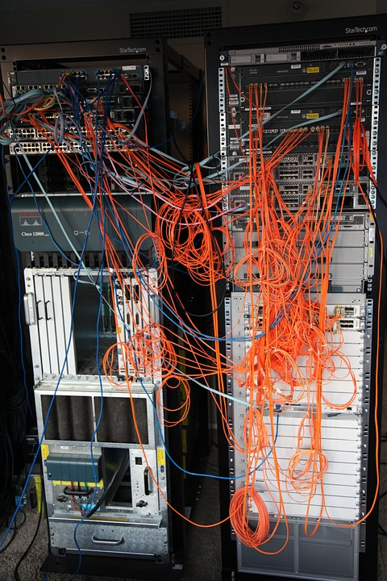
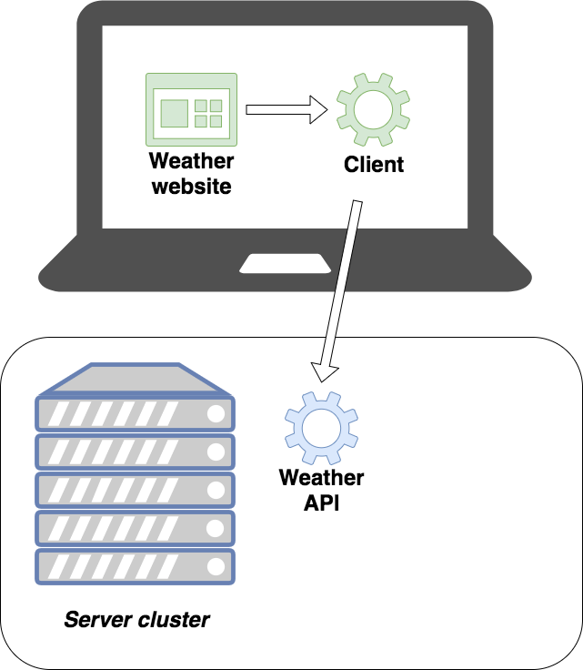
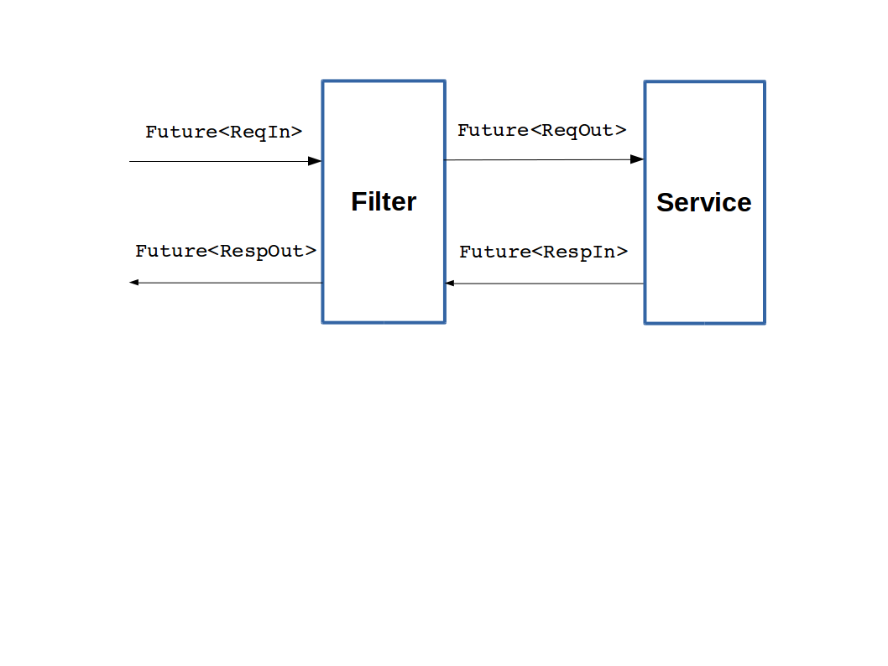
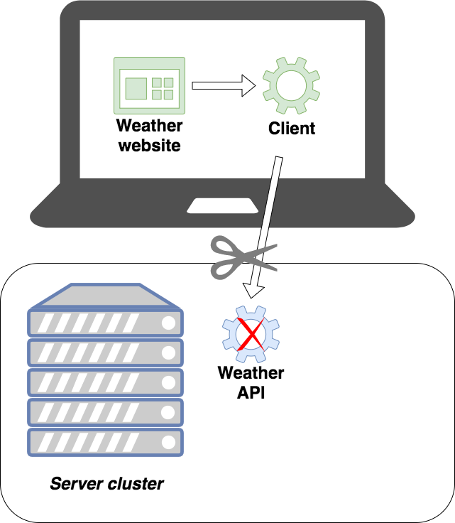
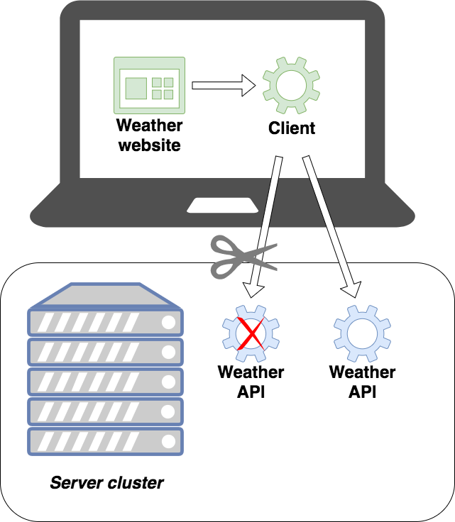
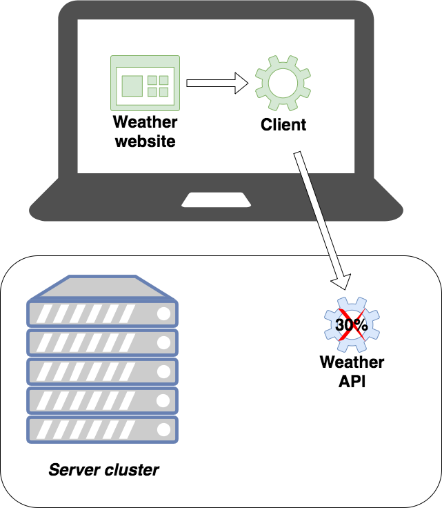
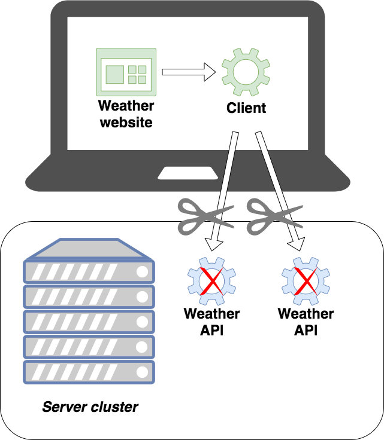
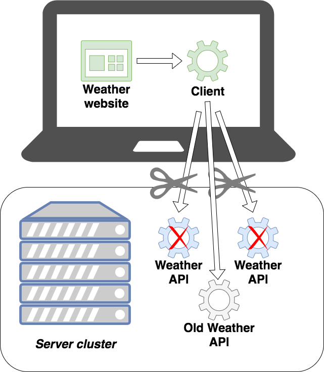

# Three resilience patterns out-of-the-box with Twitter's Finagle HTTP client
## Eggie van Buiten & Effi Bennekers

---

## Introduction

|  |  |
| - | - |
|  |  |
| Effi Bennekers | Eggie van Buiten |
| Software Engineer @ ING | Software Engineer @ ING |

^^^


^^^


---

## The challenge


^^^

### The challenge


Success rate of 0.99 ^ 100 = 0.37

^^^

### Micro services  (logical)


^^^

### Micro services  (physical)



^^^

### Resilience

Wikipedia: The ability to provide and maintain an acceptable level of service in the face of faults and challenges to normal operation.
 
Note:
- "I'm going to ask you a question. Show of hands please: who thinks a service level of 24/7 is feasible?"
- Het probleem schetsen dat 100% uptime niet te halen is

^^^

### Weather API use case



* One instance of the client API
* Two instances of the weather service API
* One instance of the old weather service API

Note:
Beschrijf de case
1 Website
We hebben 1 instance van een client api. Mobiele telefoon, weerstation, in dit geval api voor web client. 
We hebben 3 instances van een server api die weerrapporten levert
RPI 1) Weather service 2.0
RPI 2) Weather service 2.0
RPI 3) Old Weather service 1.0 (no wind) we do not use this anymore, but it is still running.

^^^

### Client code and setup

```java
@GetMapping(value = "/api/weather")
public ResponseEntity<String> loadbalance() {
  HttpGet get = new HttpGet("http://weather1:8080/weather");
  CloseableHttpResponse response = httpClient.execute(get);
  int statusCode = response.getStatusLine().getStatusCode();
  if (statusCode == 200) {
    return ResponseEntity.ok(getContentString(response));
  } else {
    return ResponseEntity.status(statusCode).build();
  }
}
```

^^^

### Finagle

From https://twitter.github.io/finagle/:

Finagle is an extensible RPC system for the JVM, used to construct high-concurrency servers. Finagle implements uniform client and server APIs for several protocols, and is designed for high performance and concurrency. Most of Finagle’s code is protocol agnostic, simplifying the implementation of new protocols.

^^^

## Finagle




---


## Load balancing


^^^

### Load balancing



^^^

### Load balancing



^^^

### Load balancing 
#### client setup

```java
    private Service<Request, Response> client;

    public FinagleLoadbalanceController() {
        String connectionString =
          "weather1:8080,weather2:8080";
        client = Http.client()
         .newService(connectionString, "loadbalancer");
    }
```

^^^

### Load balancing 
#### send request 

```java
@GetMapping(value = "/api/finagle/loadbalancing")
CompletableFuture<ResponseEntity<String>> loadbalance(){
    
    Request request = Request.apply(Method.Get(), "/weather");
    request.host("localhost");

    Future<Response> futureResponse = client.apply(request);
    return toSpringResponse(futureResponse);
}
```

---

### Retry



^^^

## Retry
#### client setup

```java
private Service<Request, Response> client;

public FinagleRetryController() {
  RetryFilter<Request, Response> retryFilter =
    new RetryFilter<Request, Response>(
      createRetryPolicy(),
      DefaultTimer.getInstance(),
      NullStatsReceiver.get(),
      RetryBudget.apply());

  client = retryFilter.andThen(
    Http.client()
      .newService("weather1:8080", "retry"));
}
```

^^^

## Retry
#### retry policy

```java
SimpleRetryPolicy<...> createRetryPolicy() {
 return
   new SimpleRetryPolicy<Tuple2<Request, Try<Response>>>(){
     public Duration backoffAt(int retry) {
        return Duration.fromMilliseconds(retry * 10);
     }
     
     public boolean shouldRetry
       (Tuple2<Request, Try<Response>> requestTryResponse) {
         Try<Response> tryResponse = requestTryResponse._2;
         return tryResponse.isReturn() &&
                tryResponse.get().getStatusCode() == 503;
     }
   };
}
```

^^^

## Retry
#### send request
```java
@GetMapping("/api/finagle/retry")
CompletableFuture<ResponseEntity<String>> getRetry() {
    Request request = Request.apply(Method.Get(), "/weather");
    request.host("localhost");

    Future<Response> futureResponse = client.apply(request);
    return toSpringResponse(futureResponse);
}
```

---

## Failover

Weather API 2.0:

```json
{
    "condition": "...",
    "temperature": "...",
    "windForce": "...",
    "windDirection": "..."
}
```

Weather API 1.0:

```json
{
    "condition": "...",
    "temperature": "..."
}
```

^^^

### Failover



^^^

### Failover



^^^

### Failover
#### client setup

```java
    private Service<Request, Response> primaryClient;
    private Service<Request, Response> secondaryClient;

    public FinagleFailoverController() {
        primaryClient =
          Http.client()
           .newService("weather1:8080,weather2:8080",
              "primary");

        secondaryClient =
         Http.client()
          .newService("oldweather:8080", "secondary");
    }
```

^^^

### Failover
#### send request

```java
@GetMapping("/api/finagle/failover")
CompletableFuture<ResponseEntity<String>> getFailover() {
  Request request = createRequest();

  Future<Response> futureResponse =
    primaryClient.apply(request)
      .rescue(
        partialFunction(x -> secondaryClient.apply(request)))
      .flatMap(primaryResponse -> {
        if (primaryResponse.getStatusCode() == 200) {
          return Future.value(primaryResponse);
        } else {
          return secondaryClient.apply(request);
        }
      });
  return toSpringResponse(futureResponse);
}
```


---

## Recap


* You need to develop with a resilience mindset
* If you take your uptime seriously and want a solution fast, use Finagle!

---

## Questions?

Effi Bennekers
Efraim.Bennekers@ing.nl
https://www.linkedin.com/in/effibennekers/
@ebennekers

Eggie van Buiten
Eggie.van.Buiten@ingbank.com

Disclaimer: The views and opinions expressed in this presentation are those of the authors and do not necessarily reflect the official policy or position of ING Bank.
